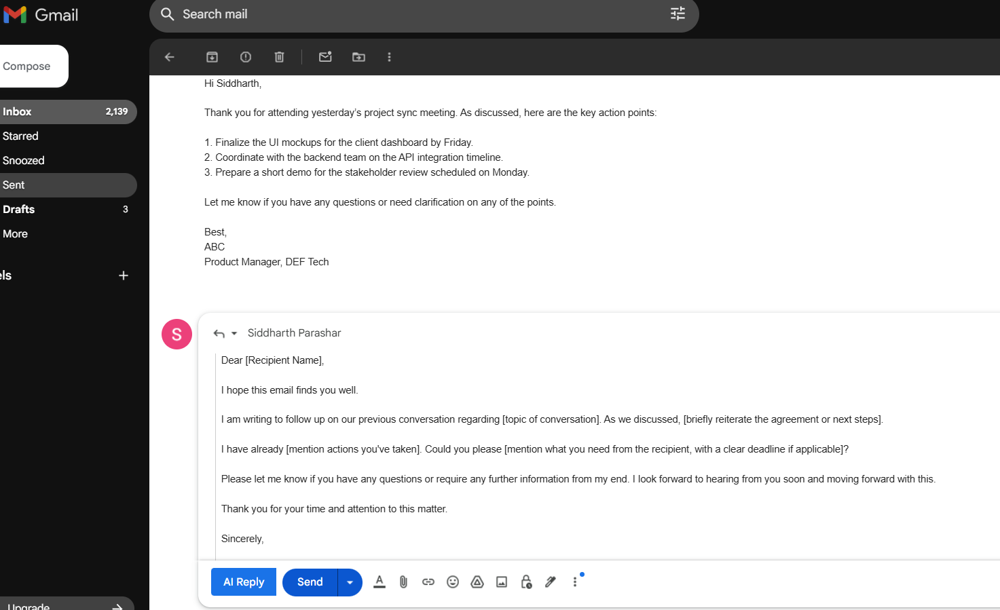
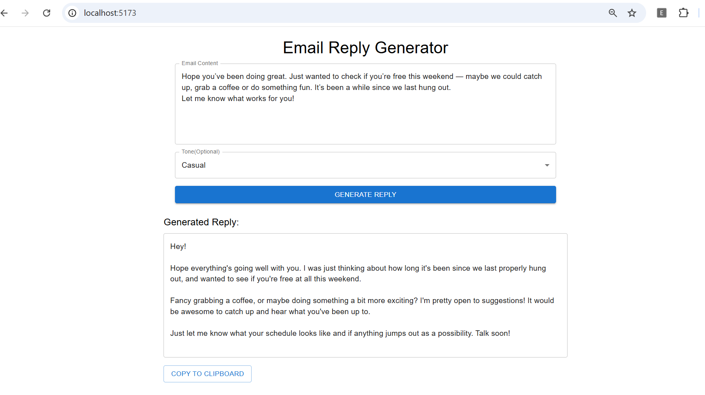
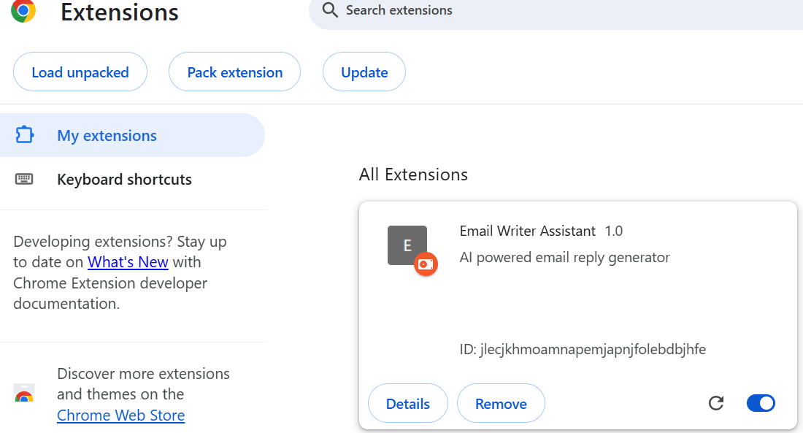

# AI Email Writer

**Email Writer** is a modular, AI-powered email assistant that helps users quickly generate intelligent replies — directly inside Gmail or through a standalone testing interface. The system integrates with Google Gemini for natural language generation and includes backend, frontend, and extension modules.

---

## Screenshots

### Gmail Reply 


### React Web App


### Extension Page View


---

## Components Overview

### Backend — `email-writer-db/`

#### Description
- Built using **Spring Boot** and **WebClient**
- Integrates with **Gemini API** for AI-generated replies
- Uses structured prompt engineering to guide Gemini's output

#### Workflow
1. Receives `emailContent` and optional `tone` from frontend/extension
2. Utilizes predefined prompt:
3. Sends the prompt to Gemini API using JSON payload
4. Extracts and returns only the generated email body

#### Endpoint
```http
POST /api/email/generate
```
---

### Chrome Extension — `email-writer-ext/`

#### Purpose
- Embeds an **AI Reply** button inside Gmail’s compose window

#### Functionality
- Detects Gmail compose interface via MutationObserver
- Injects a custom "AI Reply" button into Gmail's toolbar
- Extracts original email content from the DOM
- Sends data to the backend API
- Inserts the AI-generated reply directly into the Gmail textbox

#### Benefit
- Allows users to generate responses without leaving Gmail
---

### React Web App — `email-writer-react/`

#### Purpose
- A clean UI to test the Gemini-powered email generation service

#### Features
- Text area for original email input
- Dropdown for tone selection: *Professional*, *Casual*, *Friendly*
- Displays generated reply in a read-only textbox
- Includes "Copy to Clipboard" functionality

#### Use Case
- Internal QA and testing interface
- Can evolve into admin or API client frontend

---

## Tech Stack

| Layer        | Stack                          |
|--------------|--------------------------------|
| Backend      | Java, Spring Boot, WebClient   |
| Extension    | Vanilla JS, Gmail DOM API      |
| Frontend     | React, Vite, Material UI       |
| AI Engine    | Gemini API (configurable)      |


---

## Full Workflow Example

1. Open Gmail → click **Compose**
2. Extension detects compose window and injects AI button
3. Click **AI Reply** → email content is extracted
4. Backend receives it, builds prompt, sends to Gemini
5. Reply is generated and inserted into compose box

---

## Contact

Have ideas or found a bug?  
Open an issue or submit a PR — contributions are welcome!
